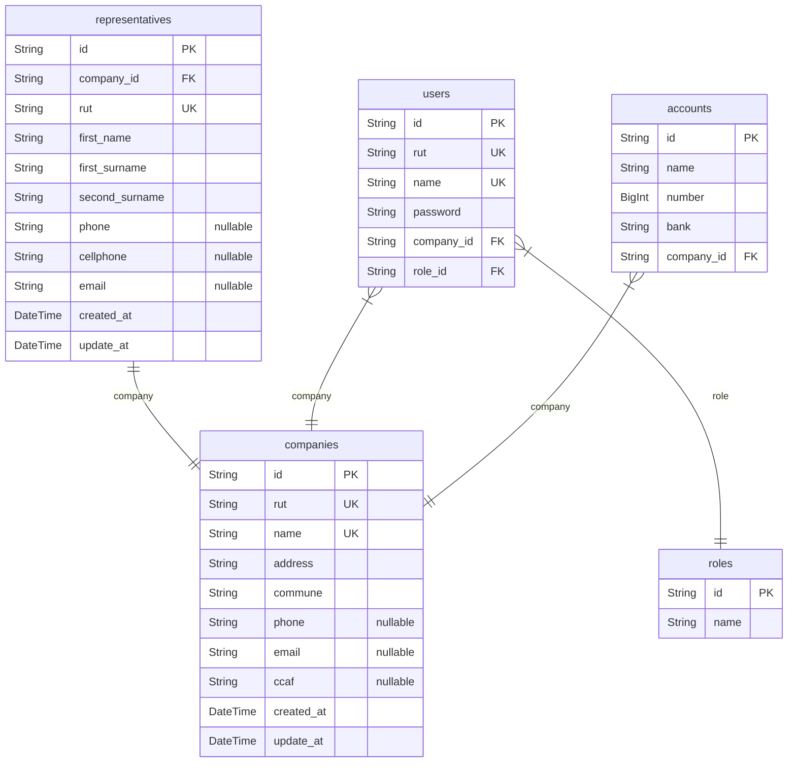
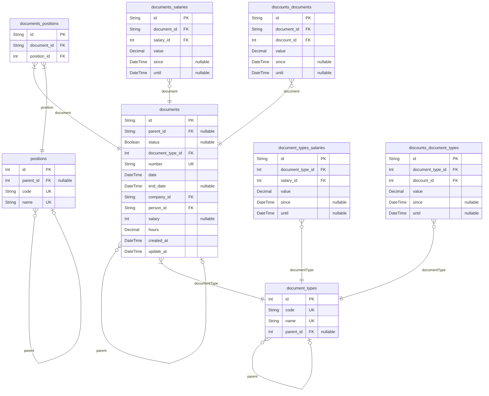
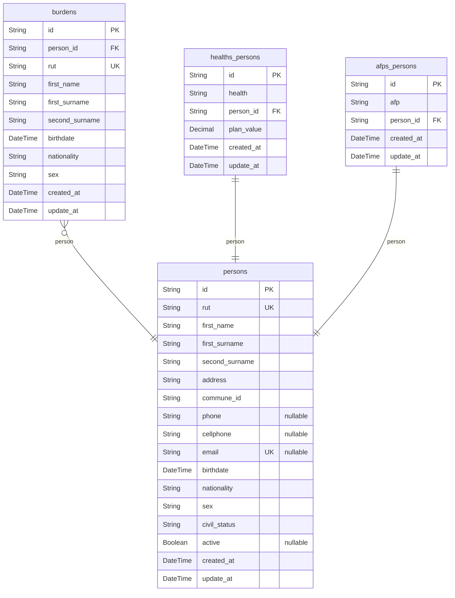
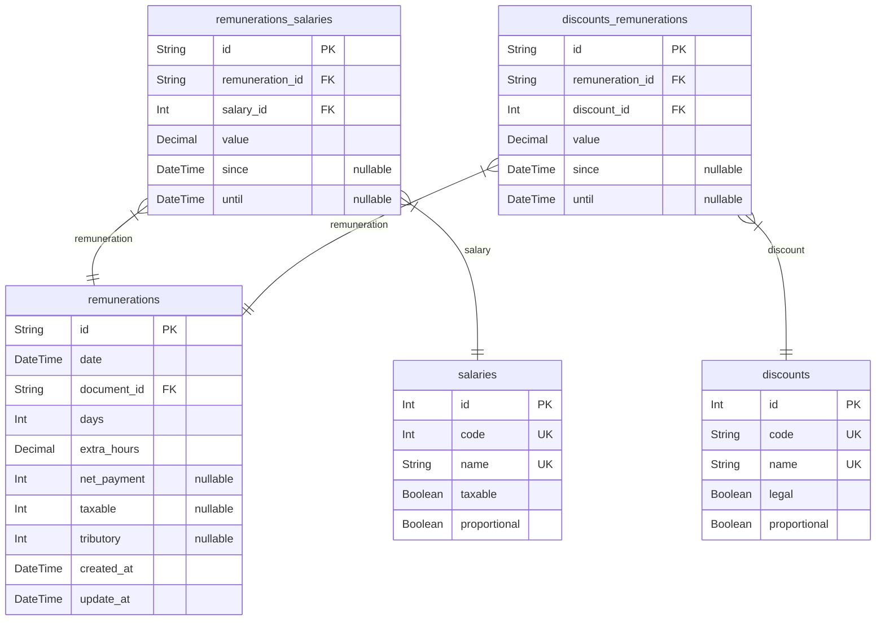

# GardelPay - Client
> Generated by [`prisma-markdown`](https://github.com/samchon/prisma-markdown)

- [Company](#company)
- [Document](#document)
- [Person](#person)
- [Remuneration](#remuneration)

## Company

### `companies`

**Properties**
  - `id`: 
  - `rut`: 
  - `name`: 
  - `address`: 
  - `commune`: 
  - `phone`: 
  - `email`: 
  - `ccaf`: 
  - `created_at`: 
  - `update_at`: 

### `representatives`

**Properties**
  - `id`: 
  - `company_id`: 
  - `rut`: 
  - `first_name`: 
  - `first_surname`: 
  - `second_surname`: 
  - `phone`: 
  - `cellphone`: 
  - `email`: 
  - `created_at`: 
  - `update_at`: 

### `users`

**Properties**
  - `id`: 
  - `rut`: 
  - `name`: 
  - `password`: 
  - `company_id`: 
  - `role_id`: 

### `roles`

**Properties**
  - `id`: 
  - `name`: 

### `accounts`

**Properties**
  - `id`: 
  - `name`: 
  - `number`: 
  - `bank`: 
  - `company_id`: 

## Document

### `document_types`

**Properties**
  - `id`: 
  - `code`: 
  - `name`: 
  - `parent_id`: 

### `positions`

**Properties**
  - `id`: 
  - `parent_id`: 
  - `code`: 
  - `name`: 

### `documents`

**Properties**
  - `id`: 
  - `parent_id`: 
  - `status`: 
  - `document_type_id`: 
  - `number`: 
  - `date`: 
  - `end_date`: 
  - `company_id`: 
  - `person_id`: 
  - `salary`: 
  - `hours`: 
  - `created_at`: 
  - `update_at`: 

### `documents_positions`

**Properties**
  - `id`: 
  - `document_id`: 
  - `position_id`: 

### `documents_salaries`

**Properties**
  - `id`: 
  - `document_id`: 
  - `salary_id`: 
  - `value`: 
  - `since`: 
  - `until`: 

### `discounts_documents`

**Properties**
  - `id`: 
  - `document_id`: 
  - `discount_id`: 
  - `value`: 
  - `since`: 
  - `until`: 

### `document_types_salaries`

**Properties**
  - `id`: 
  - `document_type_id`: 
  - `salary_id`: 
  - `value`: 
  - `since`: 
  - `until`: 

### `discounts_document_types`

**Properties**
  - `id`: 
  - `document_type_id`: 
  - `discount_id`: 
  - `value`: 
  - `since`: 
  - `until`: 

## Person

### `persons`

**Properties**
  - `id`: 
  - `rut`: 
  - `first_name`: 
  - `first_surname`: 
  - `second_surname`: 
  - `address`: 
  - `commune_id`: 
  - `phone`: 
  - `cellphone`: 
  - `email`: 
  - `birthdate`: 
  - `nationality`: chilena, extranjera
  - `sex`: Masculino. Femenino
  - `civil_status`: Casado, Separado, Soltero, Viudad, Conviviente, Divorsiado, Union Civil
  - `active`: 
  - `created_at`: 
  - `update_at`: 

### `burdens`

**Properties**
  - `id`: 
  - `person_id`: 
  - `rut`: 
  - `first_name`: 
  - `first_surname`: 
  - `second_surname`: 
  - `birthdate`: 
  - `nationality`: chilena, extranjera
  - `sex`: Masculino. Femenino
  - `created_at`: 
  - `update_at`: 

### `healths_persons`

**Properties**
  - `id`: 
  - `health`: 
  - `person_id`: 
  - `plan_value`: 
  - `created_at`: 
  - `update_at`: 

### `afps_persons`

**Properties**
  - `id`: 
  - `afp`: 
  - `person_id`: 
  - `created_at`: 
  - `update_at`: 

## Remuneration

### `remunerations`

**Properties**
  - `id`: 
  - `date`: 
  - `document_id`: 
  - `days`: 
  - `extra_hours`: 
  - `net_payment`: 
  - `taxable`: 
  - `tributory`: 
  - `created_at`: 
  - `update_at`: 

### `salaries`

**Properties**
  - `id`: 
  - `code`: 
  - `name`: 
  - `taxable`: 
  - `proportional`: 

### `remunerations_salaries`

**Properties**
  - `id`: 
  - `remuneration_id`: 
  - `salary_id`: 
  - `value`: 
  - `since`: 
  - `until`: 

### `discounts`

**Properties**
  - `id`: 
  - `code`: 
  - `name`: 
  - `legal`: 
  - `proportional`: 

### `discounts_remunerations`

**Properties**
  - `id`: 
  - `remuneration_id`: 
  - `discount_id`: 
  - `value`: 
  - `since`: 
  - `until`: 