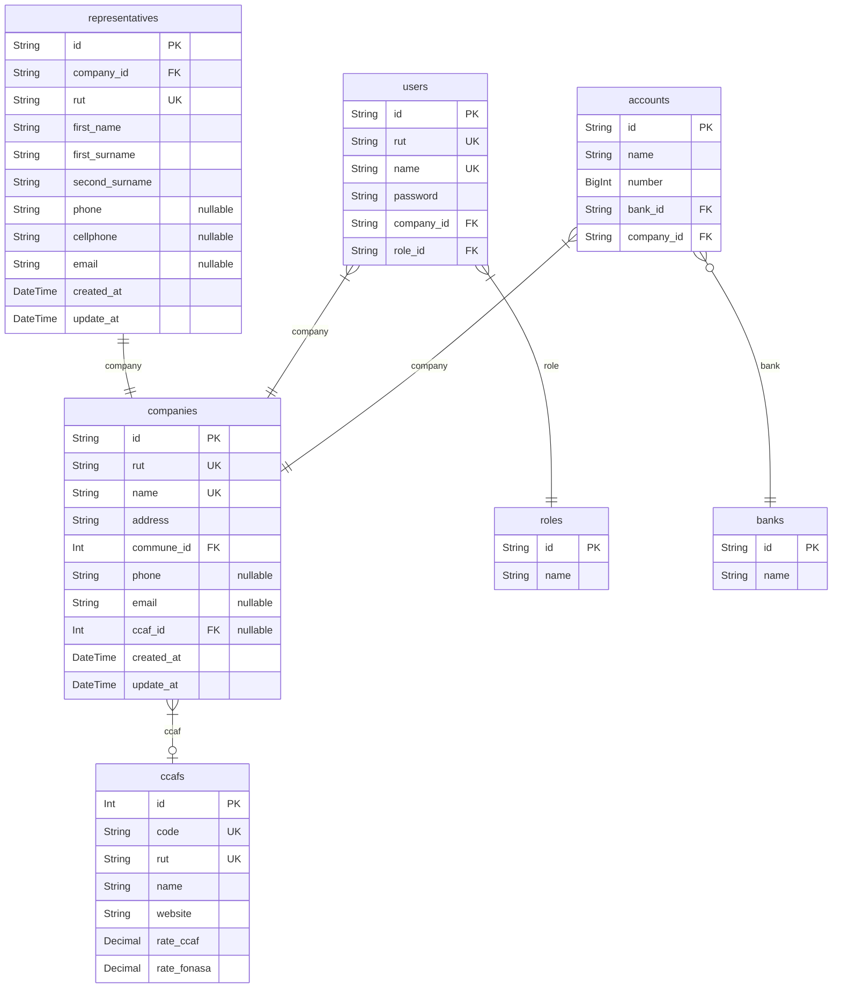
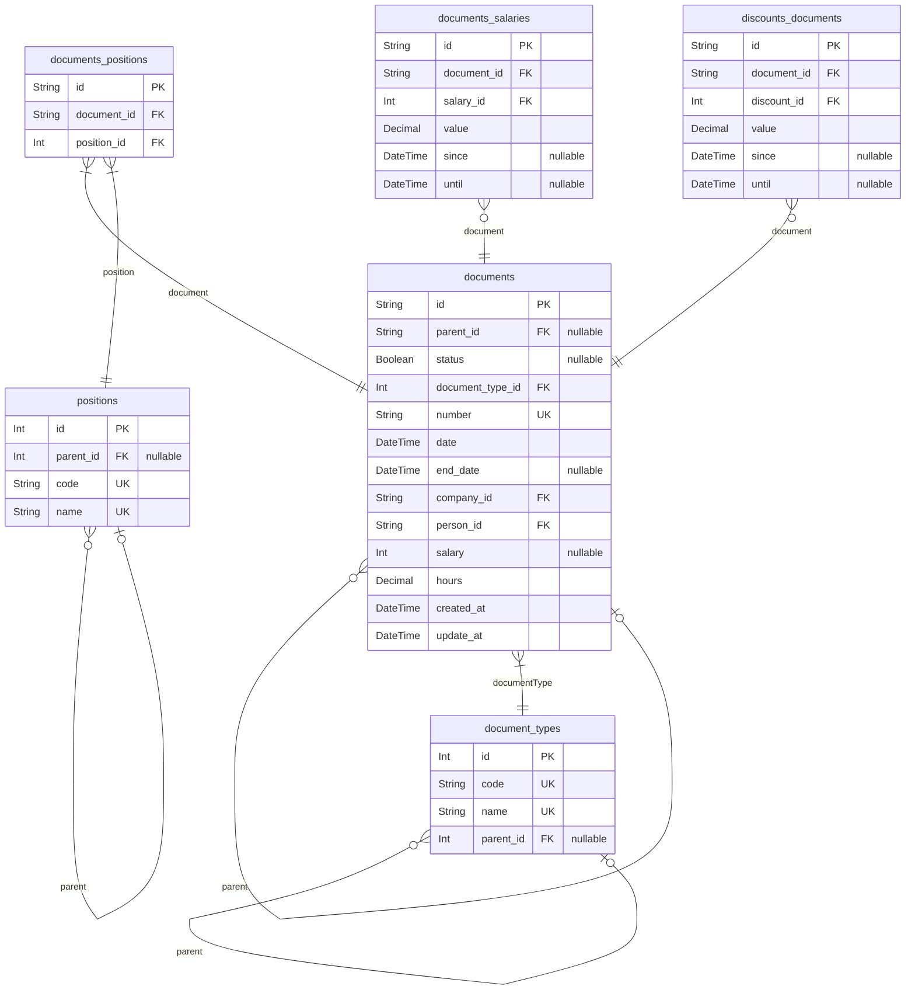
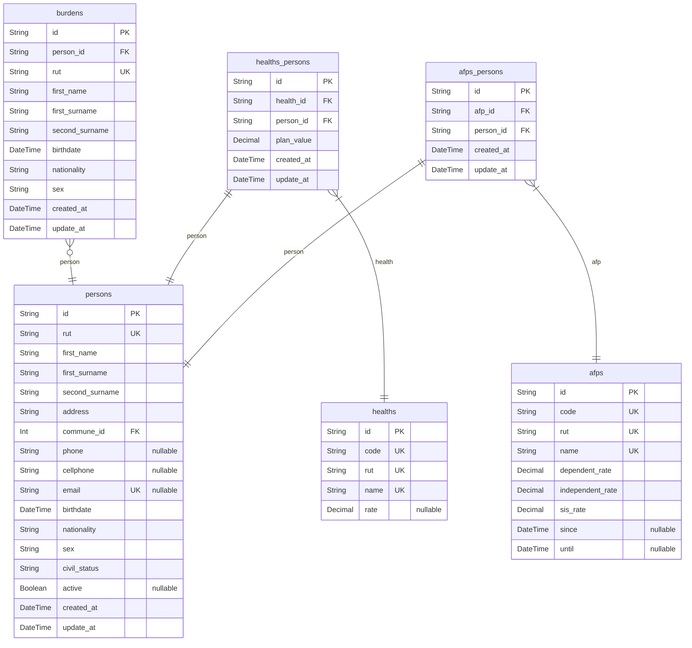
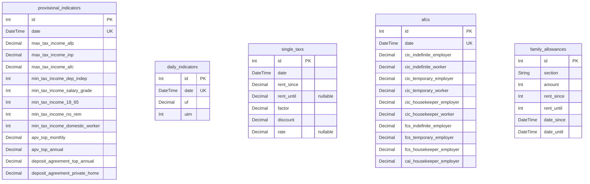
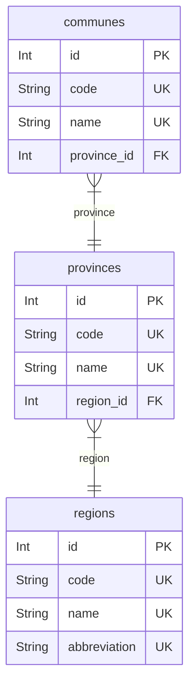
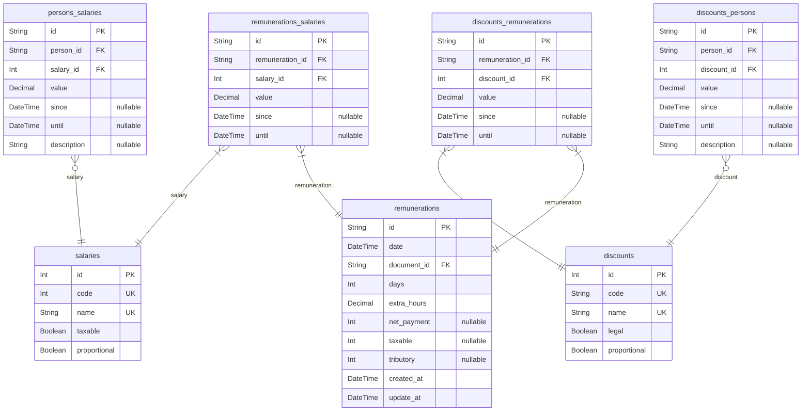

# Cautiva Technology - Remuneration
> Generated by [`prisma-markdown`](https://github.com/samchon/prisma-markdown)

- [Company](#company)
- [Document](#document)
- [Person](#person)
- [ProvisionalIndicators](#provisionalindicators)
- [Region](#region)
- [Remuneration](#remuneration)

## Company

### `companies`

**Properties**
  - `id`: 
  - `rut`: 
  - `name`: 
  - `address`: 
  - `commune_id`: 
  - `phone`: 
  - `email`: 
  - `ccaf_id`: 
  - `created_at`: 
  - `update_at`: 

### `representatives`

**Properties**
  - `id`: 
  - `company_id`: 
  - `rut`: 
  - `first_name`: 
  - `first_surname`: 
  - `second_surname`: 
  - `phone`: 
  - `cellphone`: 
  - `email`: 
  - `created_at`: 
  - `update_at`: 

### `users`

**Properties**
  - `id`: 
  - `rut`: 
  - `name`: 
  - `password`: 
  - `company_id`: 
  - `role_id`: 

### `roles`

**Properties**
  - `id`: 
  - `name`: 

### `accounts`

**Properties**
  - `id`: 
  - `name`: 
  - `number`: 
  - `bank_id`: 
  - `company_id`: 

### `banks`

**Properties**
  - `id`: 
  - `name`: 

### `ccafs`

**Properties**
  - `id`: 
  - `code`: 
  - `rut`: 
  - `name`: 
  - `website`: 
  - `rate_ccaf`: 
  - `rate_fonasa`: 

## Document

### `document_types`

**Properties**
  - `id`: 
  - `code`: 
  - `name`: 
  - `parent_id`: 

### `positions`

**Properties**
  - `id`: 
  - `parent_id`: 
  - `code`: 
  - `name`: 

### `documents`

**Properties**
  - `id`: 
  - `parent_id`: 
  - `status`: 
  - `document_type_id`: 
  - `number`: 
  - `date`: 
  - `end_date`: 
  - `company_id`: 
  - `person_id`: 
  - `salary`: 
  - `hours`: 
  - `created_at`: 
  - `update_at`: 

### `documents_positions`

**Properties**
  - `id`: 
  - `document_id`: 
  - `position_id`: 

### `documents_salaries`

**Properties**
  - `id`: 
  - `document_id`: 
  - `salary_id`: 
  - `value`: 
  - `since`: 
  - `until`: 

### `discounts_documents`

**Properties**
  - `id`: 
  - `document_id`: 
  - `discount_id`: 
  - `value`: 
  - `since`: 
  - `until`: 

## Person

### `persons`

**Properties**
  - `id`: 
  - `rut`: 
  - `first_name`: 
  - `first_surname`: 
  - `second_surname`: 
  - `address`: 
  - `commune_id`: 
  - `phone`: 
  - `cellphone`: 
  - `email`: 
  - `birthdate`: 
  - `nationality`: chilena, extranjera
  - `sex`: Masculino. Femenino
  - `civil_status`: Casado, Separado, Soltero, Viudad, Conviviente, Divorsiado, Union Civil
  - `active`: 
  - `created_at`: 
  - `update_at`: 

### `burdens`

**Properties**
  - `id`: 
  - `person_id`: 
  - `rut`: 
  - `first_name`: 
  - `first_surname`: 
  - `second_surname`: 
  - `birthdate`: 
  - `nationality`: chilena, extranjera
  - `sex`: Masculino. Femenino
  - `created_at`: 
  - `update_at`: 

### `healths`

**Properties**
  - `id`: 
  - `code`: 
  - `rut`: 
  - `name`: 
  - `rate`: 

### `healths_persons`

**Properties**
  - `id`: 
  - `health_id`: 
  - `person_id`: 
  - `plan_value`: 
  - `created_at`: 
  - `update_at`: 

### `afps`
Administradoras de Fondos de Pensiones

**Properties**
  - `id`: 
  - `code`: 
  - `rut`: 
  - `name`: 
  - `dependent_rate`: 
  - `independent_rate`: 
  - `sis_rate`: 
  - `since`: 
  - `until`: 

### `afps_persons`

**Properties**
  - `id`: 
  - `afp_id`: 
  - `person_id`: 
  - `created_at`: 
  - `update_at`: 

## ProvisionalIndicators

### `provisional_indicators`
Indicadores Previsionales

**Properties**
  - `id`: 
  - `date`: 
  - `max_tax_income_afp`: 
  - `max_tax_income_inp`: 
  - `max_tax_income_afc`: 
  - `min_tax_income_dep_indep`: 
  - `min_tax_income_salary_grade`: 
  - `min_tax_income_18_65`: 
  - `min_tax_income_no_rem`: 
  - `min_tax_income_domestic_worker`: 
  - `apv_top_monthly`: 
  - `apv_top_annual`: 
  - `deposit_agreement_top_annual`: 
  - `deposit_agreement_private_home`: 

### `daily_indicators`

**Properties**
  - `id`: 
  - `date`: 
  - `uf`: 
  - `utm`: 

### `single_taxs`

**Properties**
  - `id`: 
  - `date`: 
  - `rent_since`: 
  - `rent_until`: 
  - `factor`: 
  - `discount`: 
  - `rate`: 

### `afcs`

**Properties**
  - `id`: 
  - `date`: 
  - `cic_indefinite_employer`: 
  - `cic_indefinite_worker`: 
  - `cic_temporary_employer`: 
  - `cic_temporary_worker`: 
  - `cic_housekeeper_employer`: 
  - `cic_housekeeper_worker`: 
  - `fcs_indefinite_employer`: 
  - `fcs_temporary_employer`: 
  - `fcs_housekeeper_employer`: 
  - `cai_housekeeper_employer`: 

### `family_allowances`

**Properties**
  - `id`: 
  - `section`: 
  - `amount`: 
  - `rent_since`: 
  - `rent_until`: 
  - `date_since`: 
  - `date_until`: 

## Region

### `regions`

**Properties**
  - `id`: 
  - `code`: 
  - `name`: 
  - `abbreviation`: 

### `provinces`

**Properties**
  - `id`: 
  - `code`: 
  - `name`: 
  - `region_id`: 

### `communes`

**Properties**
  - `id`: 
  - `code`: 
  - `name`: 
  - `province_id`: 

## Remuneration

### `remunerations`

**Properties**
  - `id`: 
  - `date`: 
  - `document_id`: 
  - `days`: 
  - `extra_hours`: 
  - `net_payment`: 
  - `taxable`: 
  - `tributory`: 
  - `created_at`: 
  - `update_at`: 

### `salaries`

**Properties**
  - `id`: 
  - `code`: 
  - `name`: 
  - `taxable`: 
  - `proportional`: 

### `remunerations_salaries`

**Properties**
  - `id`: 
  - `remuneration_id`: 
  - `salary_id`: 
  - `value`: 
  - `since`: 
  - `until`: 

### `discounts`

**Properties**
  - `id`: 
  - `code`: 
  - `name`: 
  - `legal`: 
  - `proportional`: 

### `discounts_remunerations`

**Properties**
  - `id`: 
  - `remuneration_id`: 
  - `discount_id`: 
  - `value`: 
  - `since`: 
  - `until`: 

### `persons_salaries`

**Properties**
  - `id`: 
  - `person_id`: 
  - `salary_id`: 
  - `value`: 
  - `since`: 
  - `until`: 
  - `description`: 

### `discounts_persons`

**Properties**
  - `id`: 
  - `person_id`: 
  - `discount_id`: 
  - `value`: 
  - `since`: 
  - `until`: 
  - `description`: 